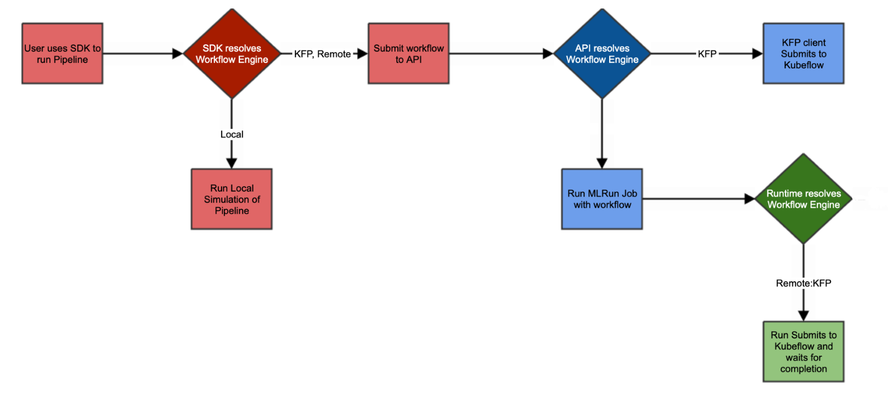
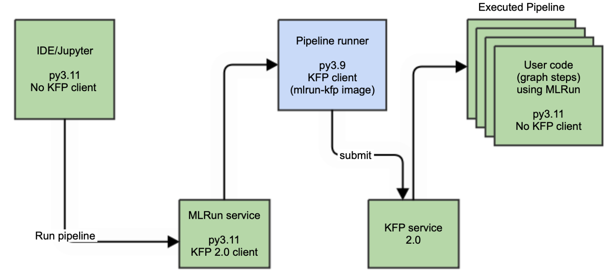
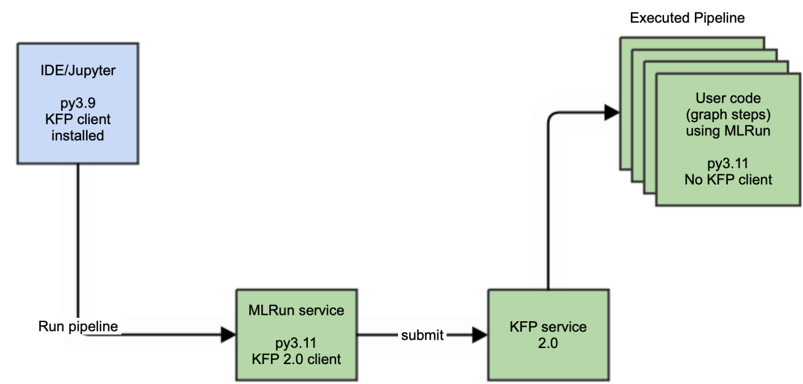
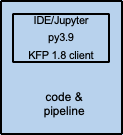

(local-remote)=
# Types of workflows, KFP, and Python
A workflow is a Python file that defines and triggers a series of MLRun jobs. There are three types of workflows, depending on where the code is compiled and executed.
- [Remote on KFP](#remote-kfp)
- [KFP](#kfp)
- [Local](#local)



- **Compiling** a workflow is converting a workflow file into runnable MLRun steps. This refers to executing the Python workflow file itself.
- **Running** a workflow is executing the MLRun jobs that are defined as steps within the workflow.

**In this section**
- [KFP](#kfp-package)
- [Python](#python)
- [Remote on KFP](#remote-kfp)
- [KFP](#kfp)
- [Local](#local)

See also {ref}`images-usage`.
 
## KFP package
MLRun supports the KFP 2.x server, but workflows still require the KFP 1.8 syntax. Usage guidelines:
- Client code, workflow code and syntax (DSL) still use the KFP 1.8 syntax. Working with the newer KFP 2.x syntax is not yet supported by MLRun.
- Starting with MLRun v1.8.0, KFP client package is not pre-installed on images such as `mlrun/mlrun`. The image `mlrun/mlrun-kfp` includes KFP.
- You can install KFP manually (`pip install mlrun[kfp18]`), for example, to [run KFP pipelines locally](#local) using the KFP 1.8 client.
## Python 
The MLRun server and client are based on a Python 3.11 environment. (Clients must also be upgraded to a Python 3.11 environment.)
- Client code and client-side images come out-of-the-box without KFP python packages installed. 
- MLRun provides an `mlrun-kfp` image that has KFP client pre-packaged in it. The only intended usage for this image is for compiling user pipeline DSL code. See [Remote-KFP](#remote-kfp) for the usages of this image. 
- You can compile your workflow locally, meaning you are not working with a remote source. (Use one of: [`engine=kfp`](#kfp) or [`engine=local`](#local)). In this case make sure you installed mlrun with kfp (`pip install mlrun[kfp18]`).
- For running workflows from Python 3.11 environments, you must use [`engine=remote`](#remote-kfp). 

## Remote-KFP 

```{admonition} Notes
- Starting from MLRun 1.9.1, the project default image no longer affects the workflow runner image.
- Starting from MLRun 1.8.0, the default workflow runner image is `mlrun/mlrun-kfp`. This image includes MLRun and KFP, but does not include custom packages. See {ref}`images-usage`.
```
<p align="center"></p>

The [Remote-KFP workflows](https://www.kubeflow.org/docs/components/pipelines/overview/) are compiled on a pod called "workflow-runner-<workflow-name>" using the workflow file that is stored in a remote source (e.g. Git, tar.gz or zip). This pod is responsible for loading the files from the remote source and running the KFP by using the files from the remote source. Each step runs as a separate pod. Remote KFP workflows support more advanced operations (conditions, branches, etc.).
If your workflow file imports custom packages, they must be included in the workflow runner image. Use one of the {py:meth}`~mlrun.projects.MlrunProject.build_image` parameters: `requirements` or `requirements_file` to add the packages.

You can modify the:
- workflow runner image: `project.set_workflow(name="main",workflow_path="workflow.py",image="<runner-image>")`
- runner node selector : `project.run("main",engine="remote",workflow_runner_node_selector={"key":"value"})`
- runner source: `project.run(source=<source-URL>)`

In some cases you might not want to load the files from the remote source, but instead use the files within the running image (see details in [build image](../projects/run-build-deploy.md#build_image)). In this case, you need to build an image that contains the workflow file and then change the workflow runner source to point to the project local files in the running image. See the example below.

Set the workflow type with `engine="remote"` in {py:meth}`~mlrun.projects.MlrunProject.run`.

Remote workflows are used for [scheduled workflows](./scheduled-jobs.md#scheduling-a-workflow). Only workflows that use the remote engine can be scheduled. 

The remote workflow supports [sending notifications](./notifications.md#remote-pipeline-notifications).

See an example of a remote GitHub project in https://github.com/mlrun/project-demo.
```{admonition} Note
From MLRun v1.7.1: when running a remote/scheduled workflow, the remote workflow pulls/extracts the remote source content to the running pod but loads the project configuration from the MLRun DB and not from the `project.yaml` file in the remote source. The remote files are primarily retrieved for:
- The [project_setup](../projects/project-setup.md) that might affect the project configuration (if it exists).
- Syncing function files.
This behavior may be unexpected for users who rely on `project.yaml` in the remote source (for the project configuration).
Be sure to update MLRun DB with the latest project configuration to ensure consistent configuration management (use `project.save()`).<br>
Project configuration in this context could be, for example, `project.node_selector` or `project.artifact_path`, and not function configurations like: function resources or function node selector.
```
```
import mlrun
project_name = "remote-workflow-example"
source_url = "git://github.com/mlrun/project-demo.git"
source_code_target_dir = "./project" # Optional, relative to "/home/mlrun_code". A different absolute path can be specified.

# Create a new project
project = mlrun.load_project(context=f"./{project_name}", url=source_url, name=project_name)

# Set the project source
project.set_source(source_url)

# Build the image based on mlrun-kfp, load the source to the target dir
result = project.build_image(base_image="mlrun/mlrun-kfp" ,target_dir=source_code_target_dir, set_as_default=False)

# Set the workflow and save the project
project.set_workflow(name="main", workflow_path="kflow.py", image=result.outputs["image"])
project.save()

# Run the workflow, load the project from the target dir on the image
project.run("main", source="./", engine="remote", dirty=True)
```

## KFP
KFP workflows are compiled on the client side using the local workflow file. The workflow jobs are run as Kubernetes pods. KFP workflows support more advanced operations (conditions, branches, etc.). Starting from MLRun 1.8+, you must install the KFP package locally: `pip install mlrun[kfp18]`. If your workflow uses additional packages, they must also be installed locally.

Set the workflow type with `engine="kfp"` in {py:meth}`~mlrun.projects.MlrunProject.run`.

<p align="center"></p>

For example:
```
project.run("main", engine="kfp")
```

## Local
The `local` engine runs the workflow as a local process. Local workflows are used to simulate a pipeline run without using KFP. Both compilation and execution happen locally on your machine: the workflows run like regular Python scripts in your IDE or Jupyter Notebook. Local workflows are used mainly for testing and running simple/sequential tasks. 

Set the workflow type with `local="true"` in {py:meth}`~mlrun.projects.MlrunProject.run`.

<p align="center"></p>

Starting from MLRun 1.8+, you must install the KFP package locally: `pip install mlrun[kfp18]`.
If your workflow uses additional packages, they must also be installed locally.

Kubeflow-specific directives like conditions and branches are not supported by the `local` engine.
Docker images and project default images do not affect this type, since everything runs locally.