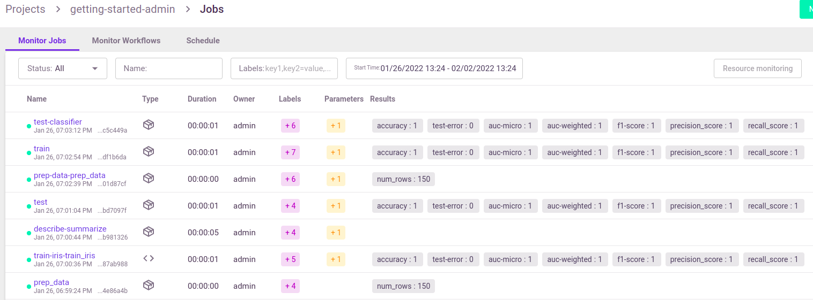

(submitting-tasks-jobs-to-functions)=
#  Running a task (job)

Learn how to submit a job using `run_function`, and use the `RunObject` to track the job and its results.

**In this section**
- [Submit tasks (jobs) using run_function](#submit-tasks-jobs-using-run_function)
- [Run result object and UI](#run-result-object-and-ui)

## Submit tasks (jobs) using run_function

Use the {py:meth}`~mlrun.projects.run_function` method for invoking a job over MLRun batch functions.
The `run_function` method accepts various parameters such as `name`, `handler`, `params`, `inputs`, `schedule`, etc.
Alternatively, you can pass a **`Task`** object that holds all of the
parameters plus the advanced options.
See: {py:func}`~mlrun.model.new_task`, and the example in [run_function](../projects/run-build-deploy.md#run_function).

Functions can host multiple methods (handlers). You can set the default handler per function. You
 need to specify which handler you intend to call in the run command.

You can pass `parameters` (arguments) or data `inputs` (such as datasets, feature-vectors, models, or files) to the functions through the `run` method.

* **Parameters** (`params`) are meant for basic python objects that can be parsed from text without special handling. So, passing `int`,
`float`, `str` and `dict`, `list` are all possible using `params`. MLRun takes the parameter and assigns it to the relevant handler parameter by name.
```{admonition} Important
Parameters that are passed to a workflow are limited to 10000 chars.
```
* **Inputs** are used for passing various local or remote data objects (files, tables, models, etc.) to the function as
{py:class}`~mlrun.datastore.DataItem`  objects. You can pass data objects using the inputs dictionary argument, where the dictionary keys
match the function's handler argument names and the MLRun data urls are provided as the values. DataItems have many methods like `local`
(download the data item's file to a local temp directory) and `as_df` (parse the data to a `pd.DataFrame`).  The dataItem objects handle
data movement, tracking, and security in an optimal way.  Read more about [data items](../store/data-items.md).

When a type hint is available for an argument, MLRun automatically parses the DataItem to the hinted type (when the hinted type is supported).

Use `run_function` as a `project` methods. For example:

```python
# run the "train" function in myproject
run_results = myproject.run_function("train", inputs={"data": data_url})
```

The first parameter in `run_function` is either the function name (in the project), or a function object if you want to
use functions that you imported/created or modify a function spec, for example:

```python
run_results = project.run_function(
    fn, params={"label_column": "label"}, inputs={"data": data_url}
)
```

```{admonition} Run/simulate functions locally:
Functions can also run and be debugged locally by using the `local` runtime or by setting the `local=True`
parameter in the {py:meth}`~mlrun.runtimes.BaseRuntime.run` method (for batch functions).
It is supported also in Jupyter notebooks.
```

MLRun also supports iterative jobs that can run and track multiple child jobs (for hyperparameter tasks, AutoML, etc.).
See {ref}`hyper-params` for details and examples.

### Handlers inside a class

You can set function handlers to methods inside a class and reference them with the
`ClassName::method_name` syntax. MLRun instantiates the class and then calls the named method
inside it. Instance methods, `@classmethod`, and `@staticmethod` are all supported.

```python
# handler.py
import mlrun


class PlainClass:
    def run(self, context: mlrun.MLClientCtx) -> int:
        context.log_result("result", 42)
        return 42
```

Reference the method with the `ClassName::method_name` handler string:

```python
fn = project.set_function(
    "handler.py",
    name="my-job",
    handler="PlainClass::run",
)
run = fn.run()
print(run.output("result"))  # 42
```

#### Passing arguments to the constructor

To initialize the class with custom arguments, define them in `__init__` and
pass them at runtime via the special `"_init_args"` key inside `params`.
MLRun unpacks that dictionary as keyword arguments to the constructor before
calling the handler method.

If the constructor also accepts a `context` parameter (or `**kwargs`), MLRun
forwards the run context automatically alongside any `_init_args` you supply — useful
when you need the context available in other methods of the class beyond the handler.

```python
# handler.py
import mlrun


class ThresholdClass:
    def __init__(self, context: mlrun.MLClientCtx, threshold: float = 0.5):
        context.logger.debug("Initializing the class")
        self.threshold = threshold

    def run(self, context: mlrun.MLClientCtx) -> None:
        value = 0.9  # extract the value from the context
        context.log_result("above_threshold", value > self.threshold)
```

Pass constructor arguments at runtime:

```python
fn = project.set_function(
    "handler.py",
    name="check-threshold-job",
    handler="ThresholdClass::run",
)
run = fn.run(params={"_init_args": {"threshold": 0.9}})
print(run.output("above_threshold"))  # True
```

### Async handlers

MLRun supports `async def` handler functions. When a handler is defined as a coroutine,
MLRun automatically detects this and runs it to completion before committing the run result.
No code changes are required beyond adding the `async` keyword to the handler definition.
The `ClassName::method_name` syntax works with async handlers too (see the examples above).

```python
import asyncio
import mlrun


async def fetch_data(context: mlrun.MLClientCtx) -> int:
    context.logger.info("Async handler started")
    await asyncio.sleep(1)  # simulate async I/O
    result_value = 42
    context.log_result("async_result", result_value)
    return result_value
```

Run the function exactly as you would a sync handler:

```python
fn = project.set_function(
    "handler.py", name="async-fetch-data", kind="job", image="mlrun/mlrun"
)
run = fn.run()
print(run.output("async_result"))  # 42
```

```{admonition} Generators are not supported as handlers
Sync generators (`def handler()` with `yield`) and async generators (`async def handler()` with `yield`)
are **not** supported as MLRun job handler return types. Returning a generator raises `MLRunRuntimeError`
and sets the run state to `error`.
```

<a id="result"></a>
## Run result object and UI

The {py:meth}`~mlrun.projects.run_function` command returns an MLRun {py:class}`~mlrun.model.RunObject` object that you can use to track the job and its results.
If you pass the parameter `watch=True` (default) the command blocks until the job completes.

Run object has the following methods/properties:
- `uid()` &mdash; returns the unique ID.
- `state()` &mdash; returns the last known state.
- `show()` &mdash; shows the latest job state and data in a visual widget (with hyperlinks and hints).
- `outputs` &mdash; returns a dictionary of the run results and artifact paths.
- `logs(watch=True)` &mdash; returns the latest logs.
    Use `Watch=False` to disable the interactive mode in running jobs.
- `artifact(key)` &mdash; returns an artifact for the provided key (as {py:class}`~mlrun.datastore.DataItem` object).
- `output(key)` &mdash; returns a specific result or an artifact path for the provided key.
- `wait_for_completion()` &mdash; wait for async run to complete
- `refresh()` &mdash; refresh run state from the db/service
- `to_dict()`, `to_yaml()`, `to_json()` &mdash; converts the run object to a dictionary, YAML, or JSON format (respectively).

<br>You can view the job details, logs, and artifacts in the UI. When you first open the **Monitor
Jobs** tab it displays the last jobs that ran and their data. Click a job name to view its run history, and click a run to view more of the
run's data.

<br>

See full details and examples in [Functions](../runtimes/functions.md).
