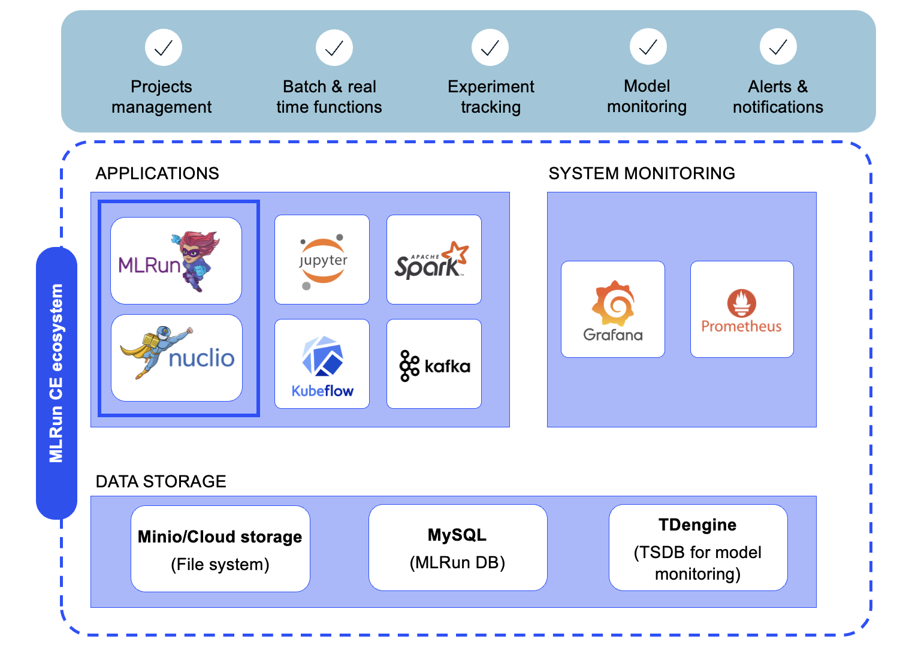

(mlrun-ce-overview)=
# MLRun CE overview

MLRun CE is an open-source platform that simplifies the entire lifecycle of your AI project. 
By installing the MLRun CE Helm chart on your Kubernetes cluster or local laptop, you get a powerful, integrated environment for developing your GenAI and ML projects.
The platform is built on two main applications: MLRun for MLOps orchestration and Nuclio for serverless computing.

**MLRun: the MLOps orchestration framework**
MLRun is the MLOps orchestration framework that automates the entire AI pipeline, from data preparation and model training to deployment and management. 
It automates tasks like model tuning and optimization, enabling you to build scalable and observable AI applications. With MLRun, you can run your batch jobs and your real-time applications over elastic resources and gain end-to-end observability.

**Nuclio: the serverless engine**
Nuclio is a high-performance serverless framework that focuses on data, I/O, and compute-intensive workloads. 
It is the engine that powers the real-time functions within MLRun. Nuclio allows you to deploy your code as serverless functions, which are highly efficient and can process hundreds of thousands of events per second. It supports various data sources, triggers, and execution over CPUs and GPUs.

**In this section**
- [MLRun CE main advantages](#mlrun-ce-main-advantages)
- [Ecosystem](#ecosystem)
- [Core components](#core-components)
- [Storage resources](#storage-resources)

**MLRun CE installation & post-installation sections**

```{toctree}
:maxdepth: 1

installation
mlrun-ce-development-notes
```
## MLRun CE main advantages

- **Open-source MLOps Solution:** MLRun CE is an open-source MLOps platform that you can quickly install on your Kubernetes cluster or local desktop by deploying the mlrun-ce chart.

- **Rapid project development:** Allows you to take your code from a Jupyter Notebook or your local IDE to a scalable k8s based platform, with minimal changes.
This significantly shortens the time-to-production, enabling faster iteration and shortening the development phase.

- **Efficient AI project management:** Gives you tools for experiment tracking, hyperparameter tuning, and model selection, allowing you to easily compare experiments, optimize models, and ensure reproducibility.

- **Scalability and Efficiency:** Automatically and elastically scale resources based on demand. This ensures that your workloads, whether batch or real-time, run efficiently, reducing computation costs. It's particularly useful for resource-intensive tasks like LLM fine-tuning or inference.

- **MLRun model monitoring:** Features a comprehensive model monitoring solution that lets you track your models, compare results and performance metrics, and detect data drift or anomalous behavior.
It also supports automated alerts for model exceptions, enabling proactive maintenance and ensuring continued model reliability.

- **Seamless Integrations:** MLRun CE seamlessly connects with a broad ecosystem of leading open-source tools, including Kubeflow Pipelines (KFP) for workflow orchestration, Spark for large-scale data processing, and Grafana for interactive visualization. Its flexible, open architecture enables you to incorporate your preferred tools and workflows, accelerating adoption and productivity.

## Ecosystem
<p align="center"></p><br>

## Core components
* MLRun - https://github.com/mlrun/mlrun
  - MLRun API
  - MLRun UI
  - MLRun DB (MySQL)
* Nuclio - https://github.com/nuclio/nuclio
* Jupyter - https://github.com/jupyter/notebook (+MLRun integrated)
* MPI Operator - https://github.com/kubeflow/mpi-operator
* SeaweedFS https://github.com/seaweedfs/seaweedfs
* Spark Operator - https://github.com/GoogleCloudPlatform/spark-on-k8s-operator
* Prometheus stack - https://github.com/prometheus-community/helm-charts
  - Prometheus
  - Grafana
* MLRun Model monitoring - 
  - Kafka - Strimzi: Apache Kafka on Kubernetes - https://strimzi.io/
  - TimescaleDB - https://docs.timescale.com/self-hosted/latest/install/
* KFP Pipelines - https://github.com/kubeflow/pipelines

## Storage resources
When installing the MLRun Community Edition, several storage resources are created:

- **PVs via default configured storage class**: Holds the file system of the stacks pods, including the MySQL database of MLRun, SeaweedFS for artifacts and Pipelines Storage and more. 
These are not deleted when the stack is uninstalled, which allows upgrading without losing data.

   See also MLRun data store [documentation](../store/datastore.md).

- **Container Images in the configured docker-registry**: When building and deploying MLRun and Nuclio functions via the MLRun Community Edition, the function images are 
stored in the given configured Docker registry. These images persist in the Docker registry and are not deleted.


## Additonal references

- **Documentation:** [MLRun Docs](https://docs.mlrun.org) | [Nuclio Docs](https://docs.nuclio.io/en/latest/index.html)
- **Quick start:** [MLRun basics tutorial](../tutorials/01-mlrun-basics.ipynb)
- **Cheat sheet:** [MLRun cheat sheet](../cheat-sheet.md)
- **Community:** [Join our Slack](https://mlopslive.slack.com) for support and discussions
- **GitHub:** [MLRun Repository](https://github.com/mlrun/mlrun)