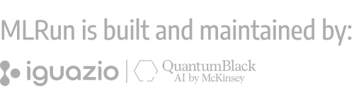

# Installation

MLRun CE can be installed on different platforms. Choose the installation guide that matches your environment:

```{toctree}
:maxdepth: 1

kubernetes-install
aws-install
mlrun-ce-installation-notes
storing-artifact-in-aws-s3-storage
```

## Next Steps

After installation, check the [development notes](./mlrun-ce-development-notes.md) for optional development configuration.

<br>
