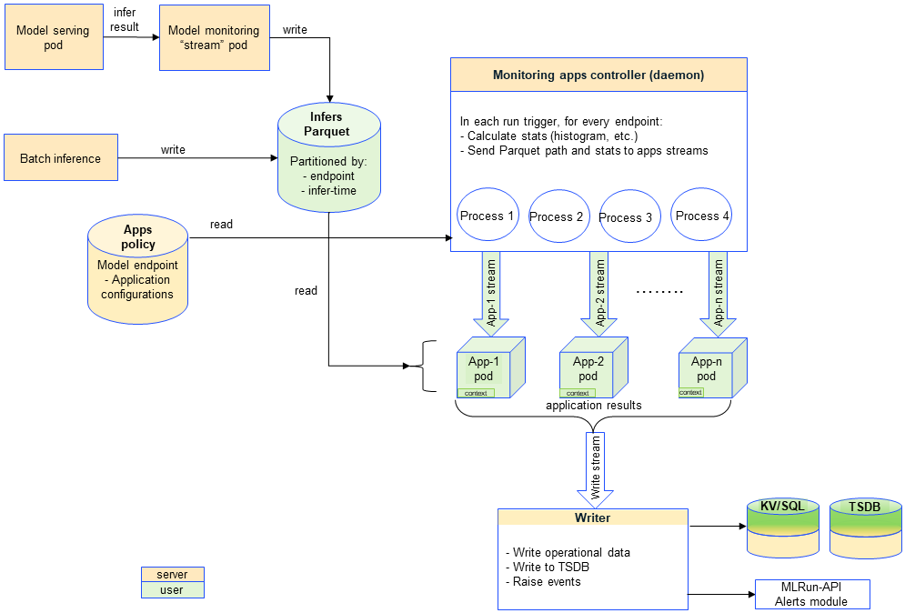
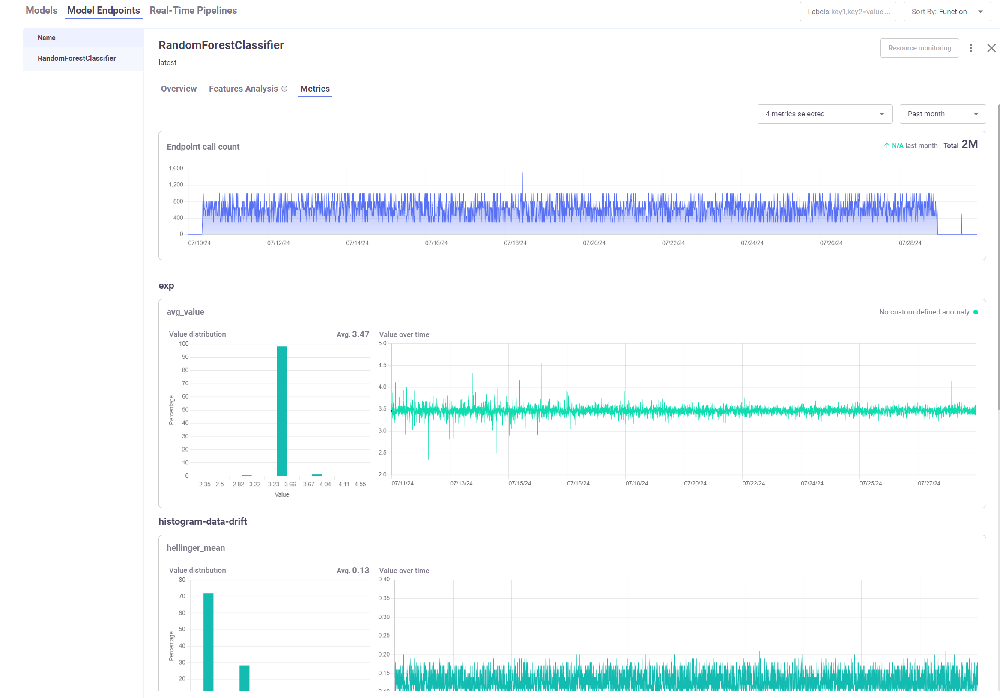

(model-monitoring-des)=
# Model monitoring architecture

Take a deeper dive into model monitoring functionality, including its APIs, model and model monitoring endpoints, multi-port predictions, batch inputs, and more.

**In this section**
- [Overview](#overview)
- [APIs](#apis)
- [Model and model monitoring endpoints](#model-and-model-monitoring-endpoints)
- [Streaming platforms and credentials](#selecting-the-streaming-and-tsdb-platforms)
- [Model monitoring applications](#model-monitoring-applications)
- [Multi-port predictions](#multi-port-predictions)
- [Batch inputs](#batch-inputs)
- [Alerts and notifications](#alerts-and-notifications)
- [Scale limitations](#scale-limitations)
- [How to upgrade from v1.7.x to v1.8.0 and higher](#upgrade-from-17)

## Overview



</br>
</br>

When you call {py:meth}`~mlrun.projects.MlrunProject.enable_model_monitoring`, you effectively deploy these three system functions:
- application controller function: handles the monitoring processing and the triggers the apps that trigger the writer. The controller is a real-time Nuclio job whose frequency is determined by `base_period`. 
- stream function: monitors the log of the data stream. It is triggered when a new log entry is detected. The monitored data is used to create real-time dashboards, detect drift, and analyze performance.
- writer function: writes the results and the metrics that output from the model monitoring applications to the databases, and outputs alerts according to the user configuration.

The model monitoring process flow starts with collecting operational data from a function in the model serving pod. The model 
monitoring stream pod forwards data to a Parquet database. MLRun supports integers, float, strings, images.
The controller periodically checks the Parquet DB for new data and forwards it to the relevant application. 
Each model monitoring application is a separate nuclio real-time function. Each one listens to a stream that is filled by 
the monitoring controller at each `base_period` interval.
The stream function examines the log entry, processes it into statistics which are then written to the statistics databases 
(parquet file, time series database and key value database). 
The monitoring stream function writes the Parquet files using a basic storey ParquetTarget. Additionally, there is a monitoring feature set that refers 
to the same target. 

## APIs

The model monitoring APIs are configured per project. The APIs are:

- {py:meth}`~mlrun.projects.MlrunProject.enable_model_monitoring` &mdash; Brings up the controller, writer and stream realtime functions, and schedules the controller according to the `base_period`. 
You can also deploy the default histogram-based data drift application when you enable model monitoring.
- {py:meth}`~mlrun.projects.MlrunProject.create_model_monitoring_function` &mdash; Creates a monitoring function object without setting it to the project, used for user-apps and troubleshooting.
- {py:meth}`~mlrun.projects.MlrunProject.set_model_monitoring_function` &mdash; Updates or adds a monitoring function to the project. (Monitoring does not start until the function is deployed.) 
- {py:meth}`~mlrun.projects.MlrunProject.list_model_monitoring_functions` &mdash; Retrieves a list of all the model monitoring functions.
- {py:meth}`~mlrun.projects.MlrunProject.remove_model_monitoring_function` &mdash; Removes the specified model-monitoring-app function from the project and from the DB.
- {py:meth}`~mlrun.projects.MlrunProject.set_model_monitoring_credentials` &mdash; Set the credentials that are used by the project's model monitoring infrastructure functions. You must set the credentials before deploying any model monitoring application or a monitored serving function.
- {py:meth}`~mlrun.projects.MlrunProject.disable_model_monitoring` &mdash; Disables the model monitoring application controller, writer, stream, histogram data drift application and the user's applications functions, according to the given parameters. 
- {py:meth}`~mlrun.projects.MlrunProject.update_model_monitoring_controller`  &mdash; Redeploys the model monitoring application controller functions.
- {py:meth}`~mlrun.config.Config.get_model_monitoring_file_target_path` &mdash; Gets the full path from the configuration based on the provided project and kind.

And for configuring alerts on model monitoring:
- {py:meth}`~mlrun.projects.MlrunProject.create_model_monitoring_alert_configs` &mdash; Creates an alert for the specified model monitoring endpoint
- {py:meth}`~mlrun.projects.MlrunProject.delete_model_monitoring_function` &mdash; Deletes the specified model-monitoring-app function/s


## Model and model monitoring endpoints

For each model that is served in a model serving function, there is a model endpoint. 

The model endpoint APIs are:

- {py:meth}`https://docs.mlrun.org/en/latest/api/mlrun.db/index.html#mlrun.db.httpdb.HTTPRunDB.get_model_endpoint`
- {py:meth}`https://docs.mlrun.org/en/latest/api/mlrun.db/index.html#mlrun.db.httpdb.HTTPRunDB.list_model_endpoints`
- {py:meth}`https://docs.mlrun.org/en/latest/api/mlrun.projects/index.html#mlrun.projects.MlrunProject.list_model_endpoints`
- {py:meth}`https://docs.mlrun.org/en/latest/api/mlrun.db/index.html#mlrun.db.httpdb.HTTPRunDB.get_metrics_by_multiple_endpoints`

All model monitoring endpoints are presented in the UI with information about the actual inference, including data on the inputs, outputs, and results.
The Model Endpoints tab presents the overall metrics. From there you can select an endpoint and view the Overview, Features Analysis, and the Metrics tabs. 
Metrics are grouped under their applications. After you select the metrics and the timeframe, you get a histogram showing the number of occurrences/values range, and a timeline 
graph of the metric and the threshold. Any alerts are shown in the upper-right corner of the metrics box. 

For example:



## Selecting the streaming and TSDB platforms

Model monitoring supports Kafka or V3IO as streaming platforms, and TDEngine or V3IO TSDB platforms.

The recommended versions are:

- TDEngine: `3.3.2.0`
- Kafka: `3.9.0` self-hosted, or Confluent Cloud (tested against `7.9`)

Before you deploy the model monitoring or serving function, you need to set the credentials with {py:meth}`mlrun.projects.MlrunProject.set_model_monitoring_credentials`.
See also [Configuring TDengine and Kafka for model monitoring](../install/kubernetes.md#configuring-tdengine-and-kafka-for-model-monitoring).

## Model monitoring applications

When you call `enable_model_monitoring` on a project, by default MLRun deploys the monitoring app `HistogramDataDriftApplication`, which is
tailored for classical ML models (not LLMs, gen AI, deep-learning models, etc.). It includes:

- Total Variation Distance (TVD) &mdash; The statistical difference between the actual predictions and the model's trained predictions.
- Hellinger Distance &mdash; A type of f-divergence that quantifies the similarity between the actual predictions, and the model's trained predictions.
- The average of TVD & Hellinger as the general drift result.
- Kullback–Leibler Divergence (KLD) &mdash; The measure of how the probability distribution of actual predictions is different from the second model's
  trained reference probability distribution.

You can create your own model monitoring applications for LLMs, gen AI, deep-learning models, etc., based on the
{py:class}`~mlrun.model_monitoring.applications.ModelMonitoringApplicationBase` class.
See {ref}`mm-applications`.</br>
You can also integrate [Evidently](https://github.com/evidentlyai/evidently)
as an MLRun function and create MLRun artifacts, using the built-in
{py:class}`~mlrun.model_monitoring.applications.evidently.EvidentlyModelMonitoringApplicationBase` class.
See an example in {ref}`realtime-monitor-drift-tutor`.

Projects are used to group functions that use the same model monitoring application. You first need to create a project for a specific application.
Then you disable the default app, enable your customer app, and create and run the functions.

The basic flow for classic ML and other models is the same, but the apps and the infer requests are different.

## Multi-port predictions

Multi-port predictions involve generating multiple outputs or predictions at the same time from a single model or system. 
Each "port" can be thought of as a separate output channel that provides a distinct prediction or piece of information. 
This capability is particularly useful in scenarios where multiple related predictions are needed simultaneously. 
Multi-port predictions increase efficiently, reducing the time and computational resources required. 
And, multi-port predictions provide a more holistic view of the data, enabling better decision-making and more accurate forecasting. 
For example, in a gen AI model, one port gives a response on prompts, one is for meta data, and the third for images.

Multi-port predictions can be applied in several ways:
- Multi-task learning &mdash; A single model is trained to perform multiple tasks simultaneously, such as predicting different attributes of 
an object. For example, a model could predict both the age and gender of a person from a single image.
- Ensemble methods &mdash; Multiple models are combined to make predictions, and each model's output can be considered a separate port. 
The final prediction is often an aggregation of these individual outputs.
- Time series forecasting &mdash; In time series analysis, multi-port predictions can be used to forecast multiple future time points 
simultaneously, providing a more comprehensive view of future trends.

## Batch inputs

Processing data in batches allows for parallel computation, significantly speeding up the training and inference processes. This is especially 
important for large-scale models that require substantial computational resources. Batch inputs are used with CPUs and GPUs. For gen AI models, 
batch input is typically a list of prompts. For classic ML models, batch input is a list of features.

See an example of batch input in the [Serving pre-trained ML/DL models](../tutorials/03-model-serving.ipynb#create-and-test-the-serving-function) tutorial.

## Alerts and notifications

You can set up {ref}`alerts` to inform you about suspected and detected issues in the model monitoring functions. 
And you can use {ref}`notifications` to notify about the status of runs and pipelines.

## Scale limitations

When ramping up the scale of your model monitoring, take note of these limitations. Each limit here assumes you have only large, medium, or small projects. When working with a combination, use these limits proportionally to adjust to your projects.
- Up to 20 large projects (model endpoints per project between 1k and 5k)
- Up to 100 medium projects (100 < model endpoints < 1k)
- Up to 200 small projects (model endpoints < 100)
- On each project and per 10 minute base-period:
  - Up to 50,000 results/metrics can be captured (V3IO-TSDB)
  - Up to 5,000 results/metrics can be captured (TDengine-TSDB)
  
**These numbers can vary depending on the overall system stress level and the TSDB performance.**

An example of a suitable V3IO-TSDB-based setup would be one project with the following specifications:
- Model monitoring enabled with a 10 minute `base-period`
- Five serving functions, each with 1000 models
- Two model monitoring apps each with 5 results

Gives:  
5 serving-functions * 1000 models * 2 model-monitoring-apps * 5 results = 50000 results per `base-period` of 10 min 

(upgrade-from-17)=
## How to upgrade from v1.7.x to v1.8.0 and higher

### Before upgrade:
1. Redeploy all monitored serving functions with set_tracking(False).
     If you didn't redeploy the functions with `set_tracking(False)` before the upgrade, you will have to update the base image of those functions after the upgrade, before redeploying them.
2. Run `project.disable_model_monitoring(delete_stream_function=True, delete_user_applications=True)`. **This deletes all MM applications, infra pods, and the streams.**

### After upgrade:
1. Set model monitoring credentials (stream and TSDB) with `project.set_model_monitoring_credentials()`.
2. Run `enable_model_monitoring`.
2. Redeploy all monitored serving functions with `set_tracking(True)`.

```{admonition} Note
You must use the v1.8.0 client to utilize model monitoring on the v1.8.0 server.
``` 
