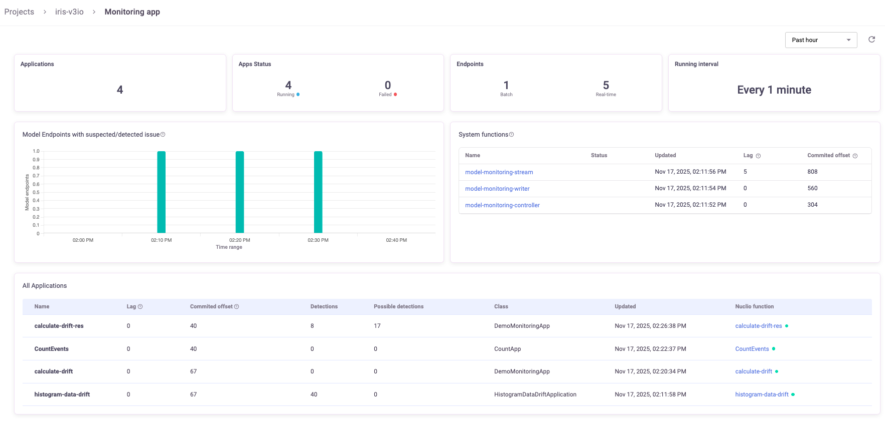
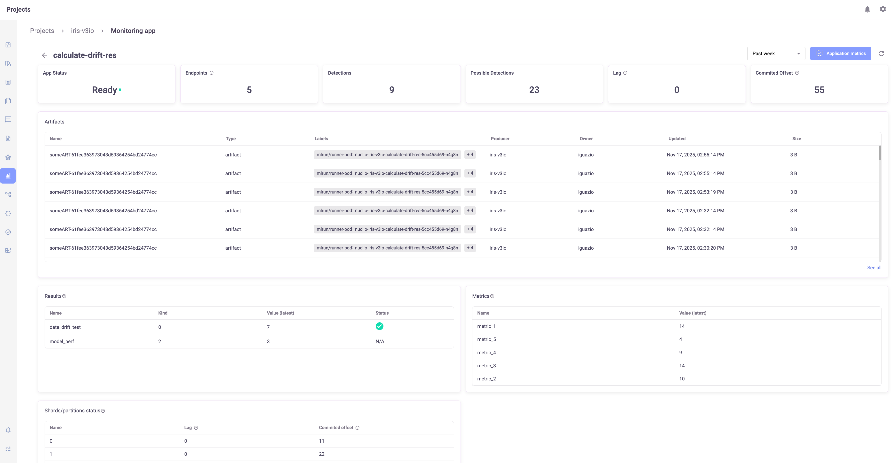
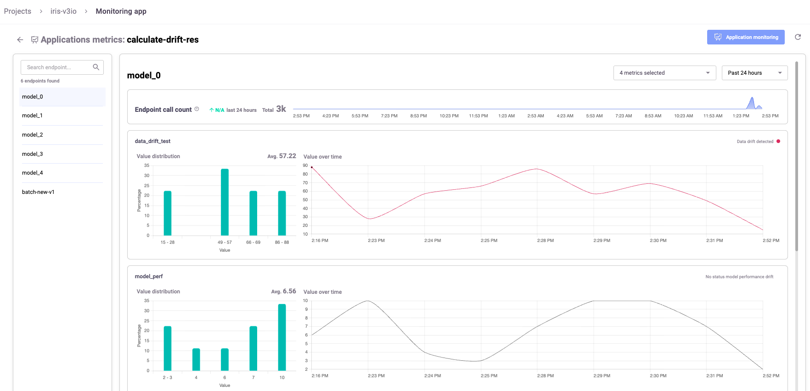

(view-mm-applications)=
# View the model monitoring applications status in the UI

The Monitoring app view provides you with a comprehensive overview of your model monitoring applications and their status, and an overview about the performance of the model monitoring infrastructure. This is where you can monitor the model monitoring. For example, if there is a lag in an app, this is the first place to get insights about what is causing the lag.

You can choose the time period for the statistics. The default time period is 24 hours. The maximum time period is one month. The selected period operates as a sliding window of 24 hours, updated every hour.

**In this section**
- [Monitoring app view](#monitoring-app-view)
- [Application page](#application-page)
- [Application metrics](#application-metrics)

## Monitoring app view

The Monitoring app view provides aggregated statistics across all functions.
The lag and commited offset statistics reflect the current state of the streams. 

 
The <b>tiles</b> at the top present:

- Applications: The total number of monitoring applications
- App Status: The number of functions running and the failed functions
- Endpoints: The total number of model endpoints, categorized by Batch and Real-time
- Running Interval: The interval at which the apps monitor the models

The <b>graph</b> shows the model endpoints with suspected/detected issues. The time interval for each bar is based on the running interval:
- Up to 6 hours: 10-minute intervals
- 2–72 hours: 1-hour intervals
- More than 72 hours: 1-day intervals

<b>System functions</b> shows the status of the three applications that support model monitoring: Controller, Writer, Reader.
See more about these functions in {ref}`model-monitoring-des`.

<b>All applications</b> presents details of the monitoring applications running in this project, including the total detections across all results and model endpoints for the selected time period.
- Click in a row to see the [application details](#application-page). 
- Hover over the row to see the Open metrics button (). Click it to open the [Application metrics](#application-metrics) page. Select a metric and optionally modify the timeframe to see the metrics graph.
- Click the Nuclio function name to get more details on that function within the Nuclio dashboard.

## Application page
From the main view, click an app name to open the App view. The tiles show the app status, number of endpoints processed by the app during the timeframe, possible detections, lag, and committed offset. The lag and commited offset statistics reflect the current state of the streams.
The following tables include: a list of all artifacts, a sampling of the most recent monitoring app results and metrics, and status of all the shards/partitions. 

## Application metrics
Access the Application metrics view either with the Application metrics button in the Application page or from the row of the app in the Monitoring Apps view. This view displays the results and metrics according to your time selection. Select a metric and optionally modify the timeframe. By default, the first model endpoint is selected. You can select another model endpoint from the list. When switching model endpoints, the previously selected metrics and results remain (if applicable).

