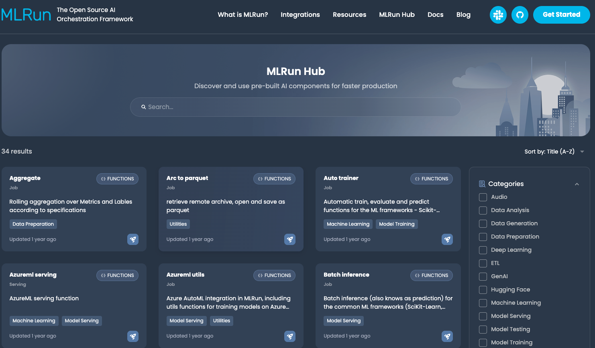

(load-from-hub)=
# Import modules and functions from the MLRun hub

The [MLRun hub](https://www.mlrun.org/hub/) provides a wide range of pre-developed functions and modules for your projects, for a variety of use cases. Reusing built-in code can significantly speed up your development cycle.
You can search and filter the categories and kinds to find an item that meets your needs. Every function and module in the hub has complete documentation and examples.

The examples in this page assume that you are working in a project and that all dependencies were already imported.

<br>



<br>

**In this section**

- [Functions](#functions)
- [Modules](#modules)
- [Custom hub](#custom-hub)

```{caution} 
**If you use custom hubs**: If you don't specify a hub name at all, the algorithm searches for the function in all the hubs, starting with the most recently defined (custom) hub and going backwards in time. The MlRun hub is the last in the search. If you have multiple hubs, best practice is to specify the hub name when importing from any hub.
```

## Functions

There are functions for ETL, data preparation, training (ML & deep learning), serving, alerts and notifications and more.
Each function has a docstring that explains how to use it. The functions are categorized and their associated versions are listed, so you can easily find a suitable function for your needs.

### Load a function from the MLRun hub

There are two ways to import a function from the hub:
- {py:meth}`~mlrun.import_function`: creates a function object that you can use as relevant, for example running it as a job
- {py:meth}`~mlrun.projects.MlrunProject.set_function`: adds or update a function object to your project


#### Use `import_function`
This example uses the aggregate function, which perform a rolling aggregation of artifacts. This example also adds a custom aggregation function that the aggregate hub function will use when it runs.

```
# Import the function
aggregate_function = mlrun.import_function("hub://aggregate")
    ```
import numpy as np

# Declare a custom aggregation function
def dist_from_mean(l):
    mean = np.mean(l)
    return abs(list(l)[3] - mean)
```

#### Use `set_function`

This example runs the [describe function](https://www.mlrun.org/hub/functions/master/describe/). This function analyzes a dataset (in this case it's a csv file) and generates HTML files (e.g. correlation, histogram) and saves them under the artifact path.

```python
# Load the `describe` function from the MLRun hub:
project.set_function("hub://describe", "describe")

# Or load the same function from your [custom hub](#custom-hub):
project.set_function("hub://<hub-name>/describe", "describe")

# Create a function object named, for example, `my_describe`:
my_describe = project.get_function("describe")
```
### View the function parameters

To view the parameters, run the function with `.doc()`:

```python
my_describe.doc()
```

``` text
    function: describe
    describe and visualizes dataset stats
    default handler: summarize
    entry points:
      summarize: Summarize a table
        context(MLClientCtx)  - the function context, default=
        table(DataItem)  - MLRun input pointing to pandas dataframe (csv/parquet file path), default=
        label_column(str)  - ground truth column label, default=None
        class_labels(List[str])  - label for each class in tables and plots, default=[]
        plot_hist(bool)  - (True) set this to False for large tables, default=True
        plots_dest(str)  - destination folder of summary plots (relative to artifact_path), default=plots
        update_dataset  - when the table is a registered dataset update the charts in-place, default=False
```


### Run the function

Use the `run` method to run the function.

When working with functions, pay attention to the following:

- Input vs. params &mdash; for sending data items to a function, send it via "inputs" and not as params. See {ref}`data-items`.
- Working with artifacts &mdash; See {ref}`artifacts`.

Example of running the `describe` function:
```python
describe_run = describe_func.run(
    name="task-describe",
    handler="analyze",
    inputs={
        "table": os.path.abspath("artifacts/random_dataset.parquet")
    },  # replace it with your dataset path
    params={"label_column": "label"},
    local=True,
)
```
Example of running the `aggregate` function:
```python
aggregate_run = aggregate_function.run(
    name="aggregate",
    params={
        "metrics": ["Temperature", "Humidity"],
        "labels": ["Occupancy"],
        "metric_aggs": ["mean", "std", dist_from_mean],
        "label_aggs": ["sum"],
        "window": 5,
        "center": True,
    },
    inputs={"df_artifact": data_path},
    local=True,
)
```

## Modules
There are two types of modules: generic and model monitoring. The modules are categorized and their associated versions are listed, so you can easily find a suitable module for your needs.
Each module in the hub has an accompanying example notebook with complete usage examples. 

There are two means of using modules from the hub:
- [Import the module as a model monitoring function and use it without modifying it](#module-off-shelf)
- [Import the module, and optionally test and modify it before running it](#modify-module)

```{admonition} Note
If you are importing a model monitoring module:
- [Set the datastore profiles](../tutorials/05-model-monitoring.ipynb#set-datastore-profiles)
- [Enable model monitoring](../tutorials/05-model-monitoring.ipynb#enable-model-monitoring)
```

(module-off-shelf)=
### Use a module "off the shelf"

To use a module directly in your project without modifying it, the code looks like:

```
fn = project.set_model_monitoring_function(
    func="hub://count_events",
    application_class="CountApp",
    name="CountEvents",
)
project.deploy_function(fn)
```
(modify-module)=
### Import and modify a module

First import the module from the hub, which downloads it to your local file system:
```
count_events_app = mlrun.import_module("hub://count_events")
```

Then run the app as a job:
```
res = count_events_app.CountApp.evaluate(func_path="count_events.py",
    run_local=False,
    sample_data=pd.DataFrame({"col": [1, 2, 3, 4]}),
                                   image=image,
                                  endpoints=["model_0"])
```
The application is now available on your filesystem, and you can register and deploy it just like any other custom application:

```
fn = project.set_model_monitoring_function(
    func="count_events.py",
    application_class="CountApp",
    name="CountEventsFromFile",
    image=image,
)
project.deploy_function(fn)
```

### View module metadata

Use `get_hub_module` to return a HubModule object that provides the metadata of the module and also includes APIs for the module, such as install the relevant requirements or download the files.
`get_hub_module` retrieves the metadata of the module without downloading it. For example:
```
# Getting hubmodule metadata
hub_module = mlrun.get_hub_module("hub://histogram_data_drift")
```

Additional operations:
```
# print out the details
hub_module.to_dict()

# Download module files into a local directory
hub_module.download_module_files("./temp")

# Import the module 
mod = hub_module.module()
```

## Custom hub
Alternatively, you can create your own hub, and connect it to MLRun. Then you can import functions (with their tags) from your custom hub.

### Create a custom hub

You can either fork the [MLRun hub repo](https://github.com/mlrun/functions) and add to it your Git repo, or create a hub from scratch.

```{Note}
Make sure your hub source is accessible via GitHub (private is also possible).
```

To create a hub from scratch, the hub structure must be the same as the [MLRun hub](https://github.com/mlrun/marketplace).

The hierarchy must be:

- functions directory
	- channels directories
		- some-function-1
		- some-function-2
		- ...
		- some-function-n
			- version-1
			- ...
			- version-n
			- latest
				- src
					- function.yaml
					- item.yaml
					- function.py
					- ...
				- static (optional)
					- html files
					
### Add a custom hub to the MLRun database
When you add a hub, specify `order=-1` to add it to the top of the list. 
The list order is relevant when loading a function.
if you don't specify a hub name, MLRun starts searching for the function with the last added hub.
If you want to add a hub but not at the top of the list, view the current list using {py:meth}`~mlrun.db.httpdb.HTTPRunDB.list_hub_source`.
The MLRun hub is always the last in the list (and cannot be modified). 

To add a hub, run:
```python
import mlrun.common.schemas

# Add a custom hub to the top of the list
private_source = mlrun.common.schemas.IndexedHubSource(
    source=mlrun.common.schemas.HubSource(
        metadata=mlrun.common.schemas.HubObjectMetadata(
            name="my_cool_hub", description="a private hub"
        ),
        spec=mlrun.common.schemas.HubSourceSpec(
            path="https://raw.githubusercontent.com/<github-user>/marketplace/refs/heads/master",  # forked from mlrun hub repo
            channel="master",  # sub-directory in the relevant asset type
        ),
    ),
)

mlrun.get_run_db().create_hub_source(private_source)
```
To access a function or module directly from your hub, specify its path, for example:
`mlrun.import_function("hub://my_cool_hub/describe")`
