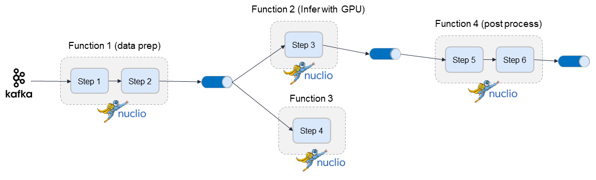

(distributed-graph-oview)=
# Distributed graphs

Graphs can be hosted by a single function (using zero to n containers), or span multiple functions
where each function can have its own container image and resources (replicas, GPUs/CPUs, volumes, etc.).
It has a `root` function, which is where you configure triggers (http, incoming stream, cron, ..), 
and optional downstream child functions.

You can specify the `function` attribute in `task` or `router` steps. This indicates where 
this step should run. When the `function` attribute is not specified it runs on the root function.</b>
`function="*"` means the step can run in any of the child functions.

Steps on different functions should be connected using a `queue` step (a stream).

**Adding a child function:**
```
fn.add_child_function(
    "enrich",
    "./entity_extraction.ipynb",
    image="mlrun/mlrun",
    requirements=["storey", "sklearn"],
)
```
A distributed graph looks like this:



See the full example in {ref}`distributed-graph`.