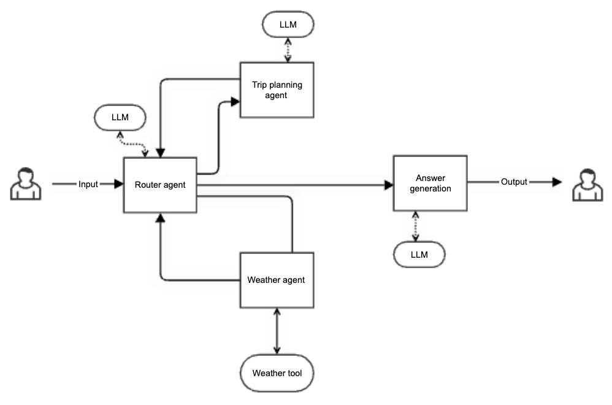
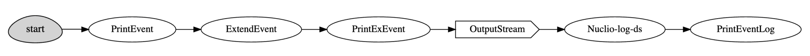

(getting-started)=
# Getting started with serving graphs

Learn how serving graphs can simplify complex workflows as illustrated in these examples.

**In this section**
- [ModelRunnerStep with proxy models for a shared model](#modelrunnerstep-with-proxy-models-for-a-shared-model)
- [Simple model serving router](#simple-model-serving-router)
- [Streaming serving function](#streaming-serving-function)
- [Cyclic graph](#cyclic-graph)
- [Serving function using Kafka queue and serving child function](#serving-function-using-kafka-queue-and-serving-child-function)

In addition to the examples in this section, see the:
- that illustrates how to set up a serving graph with batch processing with a Hugging Face model, including the Hugging Face profile configuration, creating model artifacts, and deploying a serving function.
- [Distributed (multi-function) pipeline example](./distributed-graph.ipynb) that details how to run a pipeline that consists of multiple serverless functions (connected using streams).
- [Advanced model serving graph notebook example](./graph-example.ipynb) that illustrates the flow, task, model, and ensemble router states; building tasks from custom handlers; classes and storey components; using custom error handlers; testing graphs locally; deploying a graph as a real-time serverless function.
- {ref}`MLRun demos <demos>` for additional use cases and full end-to-end examples, including GenAI serving.

## ModelRunnerStep with proxy models for a shared model

`ModelRunnerStep` is used to run multiple models on each event.
When a `ModelRunnerStep` is included in a function graph, MLRun automatically imports the default language model class (`LLModel` or `mlrun.serving.states.LLModel`) during function deployment to wrap the model for handling a LLM prompt-based inference.
This class extends the base `Model` to provide specialized handling for `LLMPromptArtifact` objects, enabling both synchronous and asynchronous invocation of language models.
Follow the class description and implement your own enrichment when custom class is needed.

Use the `add_shared_model` method to add a shared model to the graph — this model becomes accessible to all `ModelRunners` in the graph.
Use `add_shared_model_proxy` to add a *proxy model* to a `ModelRunnerStep`. A proxy model acts as a lightweight reference to an existing shared model within the graph. It allows each step to reuse the same underlying shared model without duplicating it, while still being able to assign a unique endpoint name, labels, and endpoint creation strategy for tracking or monitoring purposes. This helps maintain efficiency and consistency across multiple model runners that operate on shared models. 

### Example
Here's the basic code. See also the full example in {ref}`genai-04-llm-prompt-artifact`.
```
from mlrun.serving import ModelRunnerStep
from mlrun.common.schemas.model_monitoring.constants import (
    ModelEndpointCreationStrategy,
)

function = project.set_function(
    name="open-ai-tut",
    kind="serving",
    tag="latest",
    func="./src/LLM_file.py",
    image=image,
    requirements=["openai==1.77.0"],
)
graph = function.set_topology("flow", engine="async")

model_runner_step = ModelRunnerStep(
    name="model_runner_step", model_selector="MyModelSelector"
)

graph.add_shared_model(
    name="shared_llm",
    execution_mechanism="dedicated_process",
    model_class="LLModel",
    model_artifact=model_artifact,
    result_path="outputs",
)

model_runner_step.add_shared_model_proxy(
    endpoint_name="finance_endpoint",
    model_artifact=finance_llm_prompt_artifact,
    shared_model_name="shared_llm",
    model_endpoint_creation_strategy=ModelEndpointCreationStrategy.OVERWRITE,
)
model_runner_step.add_shared_model_proxy(
    endpoint_name="sport_endpoint",
    model_artifact=sport_llm_prompt_artifact,
    shared_model_name="shared_llm",
    model_endpoint_creation_strategy=ModelEndpointCreationStrategy.OVERWRITE,
)

graph.to(model_runner_step).respond()
```

## Simple model serving router

Graphs are used for serving models with different transformations.

To deploy a serving function, you need to import or create the serving function, 
add models to it, and then deploy it.  

```python
import mlrun

# load the sklearn model serving function and add models to it
fn = mlrun.import_function("hub://v2_model_server")
fn.add_model("model1", model_path={model1 - url})
fn.add_model("model2", model_path={model2 - url})

# deploy the function to the cluster
fn.deploy()

# test the live model endpoint
fn.invoke("/v2/models/model1/infer", body={"inputs": [5]})
```

The serving function supports the same protocol used in KFServing V2 and Triton Serving framework. 
To invoke the model, use the following url: `<function-host>/v2/models/model1/infer`.

See the [**serving protocol specification**](./model-api.md) for details.

```{note}
Model url is either an MLRun model store object (starts with `store://`) or URL of a model directory 
(in NFS, s3, v3io, azure, for example `s3://{bucket}/{model-dir}`). Note that credentials might need to 
be added to the serving function via environment variables or MLRun secrets.
```

See the [**scikit-learn classifier example**](https://github.com/mlrun/functions/blob/master/functions/src/sklearn_classifier/sklearn_classifier.ipynb), 
which explains how to create/log MLRun models.

### Writing your own serving class

You can implement your own model serving or data processing classes. All you need to do is:

1. Inherit the base model serving class.
2. Add your implementation for model `load()` (download the model file(s) and load the model into memory). 
2. `predict()` (accept the request payload and return the prediction/inference results).

You can override additional methods: `preprocess`, `validate`, `postprocess`, `explain`.<br>
You can add custom API endpoints by adding the method `op_xx(event)` (which can be invoked by
calling the `<model-url>/xx`, where operation = xx). See {py:class}`~mlrun.model`.

For an example of writing the minimal serving functions, see [Minimal sklearn serving function example](./custom-model-serving-class.md#minimal-sklearn-serving-function-example).

See the full [V2 Model Server (SKLearn) example](https://github.com/mlrun/functions/blob/master/functions/src/v2_model_server/v2_model_server.ipynb) that 
tests one or more classifier models against a held-out dataset.

## Streaming serving function

Streaming is useful when the responses are large: the responses can be sent incrementally to the user, for example, an LLM output is displayed to the user in real-time as the tokens as generated.

This example demonstrates how to create a streaming serving function that yields chunks
incrementally over HTTP. The function deploys to Nuclio and uses HTTP chunked transfer
encoding to stream results back to the client as they are produced.

```{admonition} Important
`function.invoke()` does not support streaming responses — it buffers the
entire response and tries to parse it as a single JSON object. Use `requests` with
`stream=True` instead.
``` 
### Define the streaming step

A streaming step is any step whose `do()` method is a generator (sync or async).
Each yielded value becomes a separate HTTP chunk in the response.
```
%%writefile streaming_step.py
import asyncio


class StreamingStep:
    """A step that yields chunks with a delay to simulate work."""

    def __init__(self, context=None, name=None, num_chunks=5):
        self.context = context
        self.name = name
        self.num_chunks = num_chunks

    async def do(self, event):
        if isinstance(event, bytes):
            event = event.decode("utf-8")
        for i in range(self.num_chunks):
            await asyncio.sleep(0.5)
            yield f"chunk {i}: processed '{event}'\n"
```

### Build and deploy the function
```
import mlrun

project = mlrun.get_or_create_project("streaming-example", context="./")

fn = mlrun.code_to_function(
    name="streaming-fn",
    kind="serving",
    filename="streaming_step.py",
)

graph = fn.set_topology("flow", engine="async")
graph.to(name="streamer", class_name="StreamingStep").respond()

fn.set_streaming(enabled=True)
fn.deploy()
```

### Invoke with streaming

Use `requests` with `stream=True` and iterate over chunks as they arrive.

```{admonition} Note
HTTP chunk boundaries are not guaranteed to align 1:1 with yielded values.
The network stack or proxies may coalesce multiple chunks into a single read.
```

```python
import requests

url = fn.get_url()
resp = requests.post(url, data="hello", stream=True)
resp.raise_for_status()

print(f"Transfer-Encoding: {resp.headers.get('Transfer-Encoding')}")
print()

for chunk in resp.iter_content(decode_unicode=True):
    if chunk:
        print(chunk, end="", flush=True)
```

## Cyclic graph
In agentic systems, loops and iterative refinement are common architectural patterns. Typical use cases:
- Evaluator–optimizer loop: An LLM generates a response, a secondary agent evaluates it, and if unsatisfactory, the generation is retried until quality improves or a cap is reached.
- Multi-agent orchestration: A controller agent invokes specialized sub-agents (retriever, summarizer, planner), then loops back to coordinate or refine based on their results.
- Guardrail enforcement: A safety or compliance step checks outputs and, on failure, routes control back to the generator until conditions are met.

Cycles are supported for graphs of `flow` topology and `async` engine (storey) with `kind` = `job` and `serving`. You can run it `to_mock_server` and `deploy()`.
Set a graph as cyclic using `allow_cyclic=True` in `set_topology`, or after the graph is defined with `serving.spec.graph.allow_cyclic = True`.

Cycles can return to the same step, or cycle through multiple steps. Create a multi-step cycle by listing the step names and using `cycle_to`. (See {py:meth}`~mlrun.serving.states.BaseStep.to()` and {py:meth}`~mlrun.serving.states.BaseStep.cycle_to`.) 

The following image illustrates a multi-agent orchestrator for planning trip.
It gets a user request for a trip in a specific location and dates, and plans a trip according to the expected weather.
The flow contains:
- A router agent that receives the user request and sends it to the relevant sub-agent. It also receives the answers from the agents and routes those to the relevant next steps.
- A weather agent that receives aclocation and date and uses a weather tool to return the expected weather in that location.
- A trip planning agent that receives a location and expected weather and plans a trip accordingly (using a web search).
- A response agent that receives all the information and generates an answer. 
<p align="center"></p>

### Usage
Example of creating a cycle where after the `evaluator` the `choice` step determines whether to cycle to the `generator` or continue forward to `post_process` and respond:

```python
graph.to("generator").to("evaluator").to("choice").cycle_to(["generator"]).to(
    "post_process"
).respond()
```
As an alternative to the choice step, you can implement {py:class}`~mlrun.serving.states.ModelRunnerSelector.select_outlets` in the evaluator step. See the usage in [Prevent infinite loops](#prevent-infinite-loops).

Iteration tracking is automatic, you do not need to add counters manually in the step code. The default number of iterations is 100.
If you set `max_iterations` in `set_topology` and in `add_step`, the value in `add_step` takes precedence. 
```{admonition} Important
- If stop conditions (`max_iterations`) are misconfigured, cycles can lead to an infinite execution of graph steps.
- Rerunning steps in a loop can cause unexpected compute spikes and higher costs.
- Step failures inside a cycle could repeat continuously, amplifying errors.
Any of these issues make graph execution harder to debug and monitor, and
increase the risk of resource exhaustion (workers, memory, execution slots).
```

When a RuntimeError is raised:
- If you provided an error handler, the event invokes the error handler
- If you did not provide an error handler, the error is raised to the client
A typical error is `RuntimeError(f"Max iterations exceeded in step '{self.name}' for event {event.id}")`.

### Example
```python
# Define the function
function = project.set_function(
    name="cyclic-function",
    func="cyclic.py",
    kind="serving",
    image="mlrun/mlrun",
)
# Define the graph (global cap applies unless overridden per-step)
graph = function.set_topology(
    "flow", engine="async", allow_cyclic=True, max_iterations=100
)
graph.to(name="preprocess", class_name="Processor").to(
    name="generator", class_name="Generator", after="preprocess", max_iterations=30
).to(name="evaluator", class_name="Evaluator", after="generator").to(
    name="evaluation-loop",
    class_name="ChoiceHandler",
    cycle_to=["generator"],
    after="evaluator",
).to(
    name="output", handler="responder", after="evaluation-loop"
).respond()

# Adding error handler to the graph
graph.error_handler(class_name="HandleError")

# Mock server
mock = graph.to_mock_server()
mock.test("/", body={...})

# Kubernetes deployment
function.deploy()
function.invoke("/", body={...})
```
### Prevent infinite loops
To ensure that your graph does not become infinite, use one of the following two approaches:
- Extend an existing step by implementing {py:class}`~mlrun.serving.states.ModelRunnerSelector.select_outlets` to explicitly control the flow and prevent cycles. 
Example:
```python
class MyStep:
    def do(self, event):
        # Process the event
        ...
        return event

    def select_outlets(self, event):
        if event["should_continue"]:
            return ["continue"]
        return ["stop"]
```     
- Implement a custom step that inherits from {py:class}`~storey.transformations.Choice`. Override the `select_outlets` method to control which outlets are selected at runtime. 
Example:
```python
import storey


class MyChoiceStep(storey.Choice):
    def select_outlets(self, event):
        if event["should_continue"]:
            return ["continue"]
        return ["stop"]
```
The list returned by `select_outlets` must include only valid step names that follow the current step in the graph flow. If the current step is the responder, use Complete as the outlet name to exit the graph and return the response.

## Serving function using Kafka queue and serving child function

Queues accept data from one or more source steps and publish to one or more output steps. You can use them to send events from one part of a graph to another and to decouple the processing of those parts.

```Python
graph = fn_serving.set_topology("flow", engine="async")
fn_child = fn_serving.add_child_function("nuclio-log-ds", "nuclio_log_dataset.py", "mlrun/mlrun")

graph.to(name="PrintEvent", handler="print_event").to(
    name="ExtendEvent",class_name="storey.Extend", _fn='({"extend": "something"})').to(
    name="PrintExEvent", handler="print_event").to(
    ">>", "OutputStream", path=topic_out, kafka_brokers=brokers).to(
    name="Log-ds", function="log-ds",handler="save_record").to(
    name="PrintEventLog", handler="print_event_log", function="log-ds")

graph.plot(rankdir="LR")
```
<br><br>

```Python
addr_serving = fn_serving.deploy()
events = [{"int": 2, "x2": 2 * 2} ]
payload = {"records": events}
result = fn_serving.invoke("", body=payload)
```

Currently, queues support Iguazio V3IO and Kafka streams. 
See more about Kafka in [Kafka stream example](../serving/remote-execution.ipynb#kafka-stream-example).