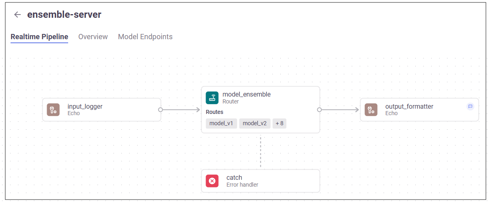

(serving-graph)=
# Real-time serving pipelines (graphs)

The MLRun serving graph is a realtime orchestration layer for your ML/GenAI logics. It is storey-backed async graph of steps that runs inside a serving runtime.
Graphs are configurable, observable, async DAG/graphs that run your realtime ML/GenAI workflow behind a standardized REST endpoint.

## Why use a serving graph?
There are multiple use cases for serving graphs, answering needs such as:
- More complexity than “single model in, prediction out.”
  For example, a Gen AI chatbot that: preprocess input → enriches with context → calls an LLM → runs an LLM as a judge guardrail → possibly loops back for retries → and finally does the post processing and formatting of responses.
  You could implement all of this in a single handler, but a serving graph gives you a clear separation of steps, reuse of standard building blocks (Batch, Filter, Choice, RemoteStep, LLM/RAG steps), and better debugging capabilities and observability of each step.
- Orchestration logic or multiple models. A serving graph is effectively the orchestration engine, but embedded right into the serving function. Graphs support ensembles of models, routers that choose a model based on request,
multi-agent patterns (router → tools → planner → responder), and feedback loops for quality/safety.
- Streaming responses or high concurrency, supported by the streaming and async integration in serving graphs. For LLMs and other I/O bound workloads, you can stream partial outputs to the user, and efficiently handle many concurrent requests.
- Standard API support while keeping custom internal logic. With the API handler you can implement industry-defined REST API schemas on your serving graph
  (for example, the OpenAI chat-completion interface for LLMs), and gate access to specific paths.
  This paradigm is useful if you want compatibility with existing clients and tools, with the freedom to evolve your internal pipeline.
- Production grade operations. Serving graphs are integrated with: model monitoring; Nuclio’s scaling and async HTTP; UI for status and topology.


## Building graphs
Graphs are composed of individual steps: {ref}`pre-defined graph steps<building-graphs>`,  [custom steps](./writing-custom-steps.ipynb),
from native python classes/functions, and steps you import from the {ref}`MLRun hub<hub-steps>` or {ref}`your own hub<git-repo-as-hub>`. 

Serving graph features include:
- [Cyclic graphs](../serving/getting-started.md#cyclic-graph) for use in iterative and agentic workflows, enabling patterns like the evaluator–optimizer loop, guardrail enforcement, large-scale data or inference pipelines, and multi-agent communication. Typical use cases include agent steps that require feedback, retry, or coordination loops (common in GenAI-driven workflows).
- [Batching](../genai/deployment/gpu_utilization.md#batching), whereby you can control which parts of graph use batching. 
- [Streaming responses](../serving/getting-started.md#streaming-serving-function) whereby tokens are sent back as they are generated rather than wait until all the tokens are generated. You can use multiple streaming steps in a graph. Streaming responses reduce latency.
- The [ModelRunnerStep](../serving/model-serving-steps.md#modelrunnerstep), for running multiple models on each event with control over how they are executed in terms of concurrency and parallelism. 
- LLM support. When a ModelRunnerStep is included in a graph, MLRun automatically imports the default language model class during function deployment to wrap the model for handling an LLM prompt-based inference. See an example in {ref}`genai-serving-graph`.

Graphs can run inside your IDE or Notebook for test and simulation. 

Serving graphs are built on top of the [Nuclio real-time serverless engine](https://docs.nuclio.io/en/latest/), {ref}`MLRun jobs<job-function>`, [MLRun Storey](<https://github.com/mlrun/storey>) (native Python async and stream processing engine), and other MLRun facilities. 

By default, all steps of the serving graph run on the same pod. It is possible to run different steps on different pods using distributed pipelines. Typically you run steps that require CPU on one pod, and steps that require a GPU on a different pod that is running on a potentially different node that has GPU support. See {ref}`distributed-graph-oview`.

## Serving graph UI
The realtime pipelines UI page displays: 
- A table of serving graphs with a few parameters that can be filtered
- The total number of graphs/pipelines, the status of the main function, and the total number of endpoints
- Each graph step is identified by an icon according to its category, and displays details of the graph steps
- A model endpoints tab

Typical serving graph in the UI:


**In this section**

```{toctree}
:maxdepth: 1
basic-example
getting-started
api-handler
building-graphs
deploying-graphs
demos
graph-advanced-cfg
```