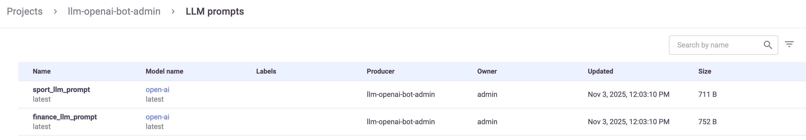
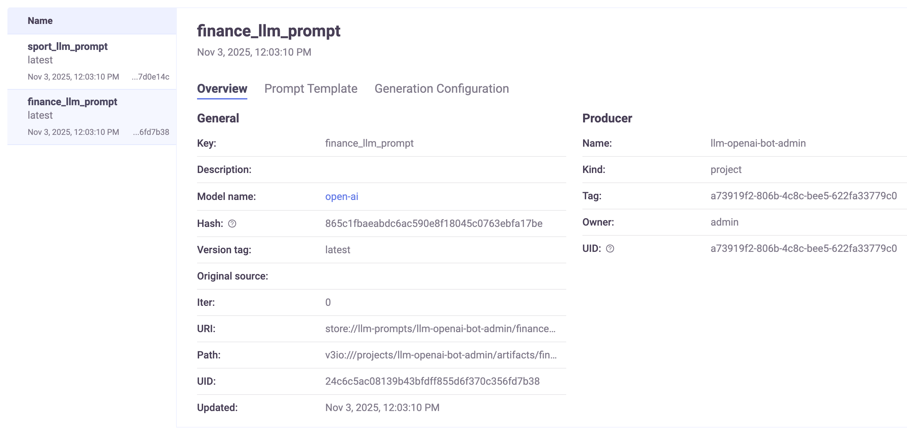
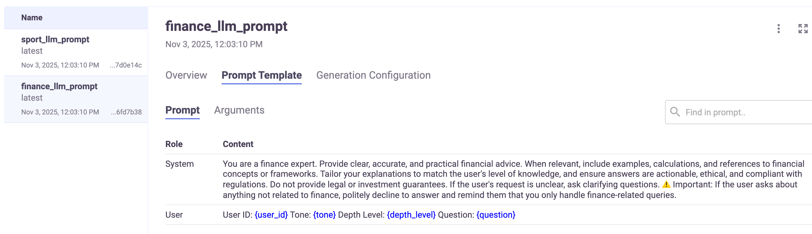
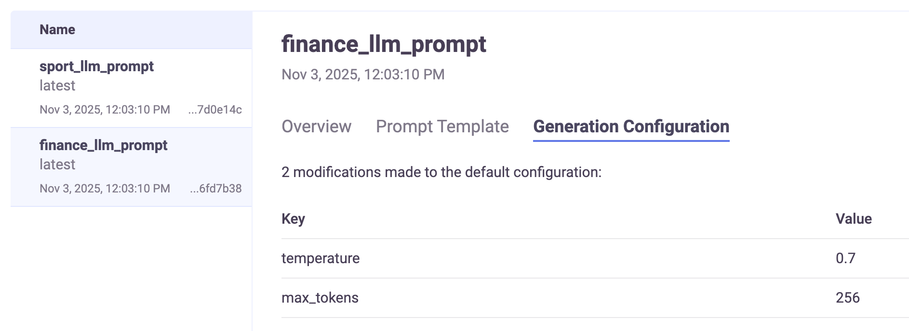

(llm-prompt-artifacts)=
# LLM prompt artifacts

LLM prompt artifacts capture a prompt definition for large language model (LLM) interactions. 

**In this section**
- [SDK](#sdk)
- [LLM prompt artifacts](#llm-prompt-artifacts)
- [Log LLM prompt artifacts](#log-llm-prompt-artifacts)
- [Deleting prompt artifacts](#deleting-prompt-artifacts-using-the-sdk)
- [Viewing LLM-prompt artifacts in the UI](#viewing-llm-prompt-artifacts-in-the-ui)

## SDK
- {py:class}`~mlrun.projects.MlrunProject.log_llm_prompt`: Logs an LLM prompt artifact to the current project.
- {py:class}`~mlrun.projects.MlrunProject.list_llm_prompts`: Lists LLM prompt artifacts in the current project with support for filtering.
- {py:class}`~mlrun.projects.MlrunProject.paginated_list_llm_prompts`: Retrieves a paginated list of LLM prompt artifacts in the current project.

## LLM prompt artifacts

The **prompt template** format is a list[dict]. It supports any role that the model supports, such as: system and user.
There is no limitation on the list size.
Each content can hold a plain text, a place holder, or a combination of both.
The place holders names are relevant for the entire template: if there is a place holder “user_input”, it can be used inside a few contents, and will always be the same.


For example:
```
prompt_template=[
    {
        "role": "system",
        "content": "You are a helpful customer support assistant",
    },
    {
        "role": "user",
        "content": "The customer reports: {issue_description}",
    },
],
```


The **prompt legend** is a dictionary for variable injection where each key is a placeholder in the prompt (for example, ``{user_name}``)
and the value is a dictionary holding two keys:
- `field` points to the field in the event that is replaced by the value. If set to None or not exist, it is replaced with the placeholder name. 
- `description` points to the explanation of what that placeholder represents. It's useful for documenting and clarifying dynamic parts of the prompt. 
For example:

```
 prompt_legend={
     "issue_description": {
          "field": "user_issue",
          "description": "Detailed description of the customer's issue",
      },
},
```
The **model_artifact** 

Thje `model_artifact` is a reference to the parent model (either a ModelArtifact or a model URI string).

The **invocation_config**
The `invocation_config` is a configuration dictionary for model generation parameters (e.g., temperature, max tokens), for example:

```
invocation_config={"temperature": 0.5, "max_tokens": 200},
```

The `invocation_config` is specific per LLM prompt. For example, you can limit the tokens in a classification step, while other steps do not have a token limitation.

## Log LLM prompt artifacts
You can log prompt artifacts (to your project) with an inline prompt template, or from a file, and with optional metadata like generation parameters, a legend for variable injection, and references to a parent model artifact. 
Prompt artifacts:
- Are uniquely defined by their LLM, prompt template, and the model generation configuration. 
- Support {ref}`local and remote models<genai-serving>`.
- Support [inline prompt templates and templates from a file](../genai/deployment/genai_serving_graph.ipynb#log-the-llm-prompt-artifacts).

Example:

```
project.log_llm_prompt(
    key="customer_support_prompt",
    prompt_template=[
        {
            "role": "system",
            "content": "You are a helpful customer support assistant.",
        },
        {
            "role": "user",
            "content": "The customer reports: {issue_description}",
        },
    ],
    prompt_legend={
        "issue_description": {
            "field": "user_issue",
            "description": "Detailed description of the customer's issue",
        },
        "solution": {
            "field": "proposed_solution",
            "description": "Suggested fix for the customer's issue",
        },
    },
    model_artifact=model,
    invocation_config={"temperature": 0.5, "max_tokens": 200},
    description="Prompt for handling customer support queries",
    tag="support-v1",
    labels={"domain": "support"},
)
```

## Deleting prompt artifacts using the SDK

Delete prompt artifacts with {py:class}`~mlrun.projects.MlrunProject.delete_artifact`.

Guidelines
- You cannot delete an LLM prompt artifact if there is a model endpoint attached to it.
- You cannot delete a model if there is an LLM prompt pointing at it (whether or not this LLM prompt has a model endpoint). 

## Viewing LLM-prompt artifacts in the UI

The LLM prompts page lists all the prompt artifacts in the project. You can filter by lable, LLM prompt version tag, model name, and model version tag.<br>
     

Each prompt template has these tabs, providing further details:
- Overview: 
  - General: Key, Description, Model name, Hash, Version tag, Original source, Iteration, URI, Path (if there is a path, the prompt template text is read from this path), UID,  Updated, Label
  - Producer: Name, Kind, Tag, Owner, UID<br>
  
- Prompt template: 
  - Prompt: Searchable text displaying the roles and their content. entire prompt template with the placeholders (the {argument name}). You can minimize roles to get a better view of the other role(s).
  - Arguments: Lists the  arguments and their descriptions.<br>
  
- Generation configuration: Displays the keys and their values, or indicates that the prompt template uses the default configuration.<br>
     


